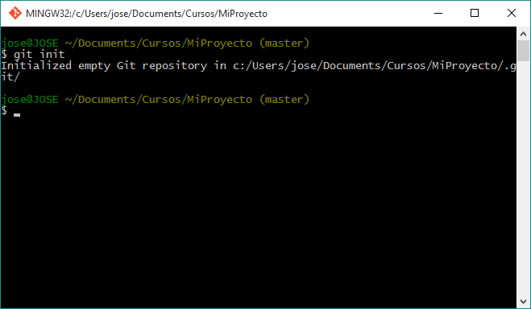
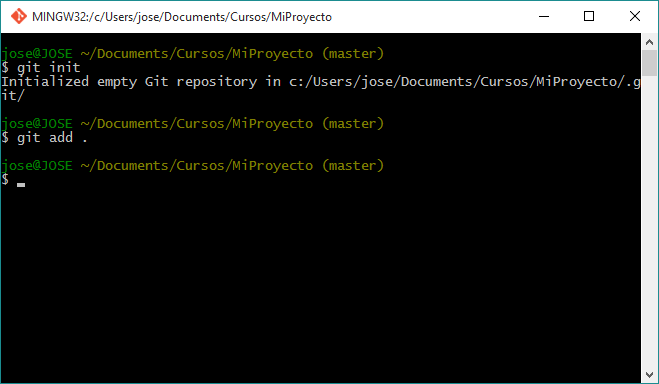
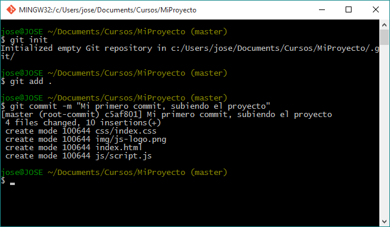
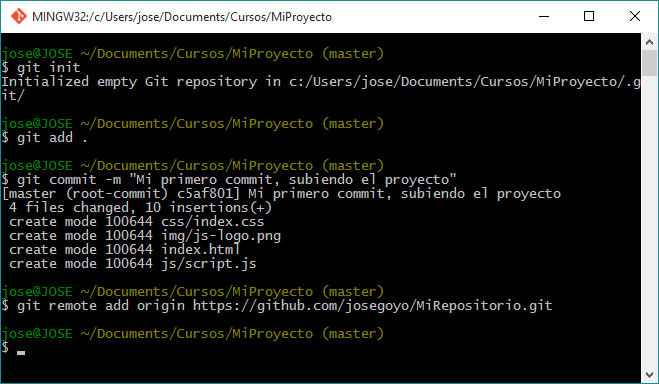
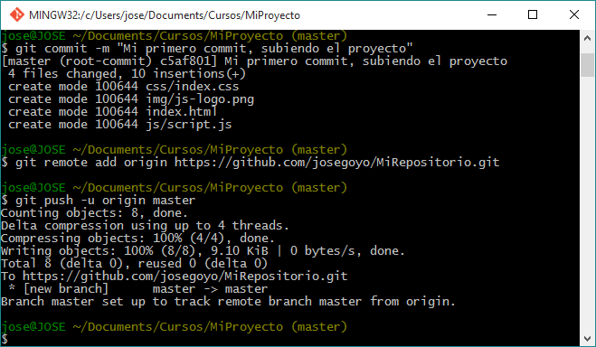
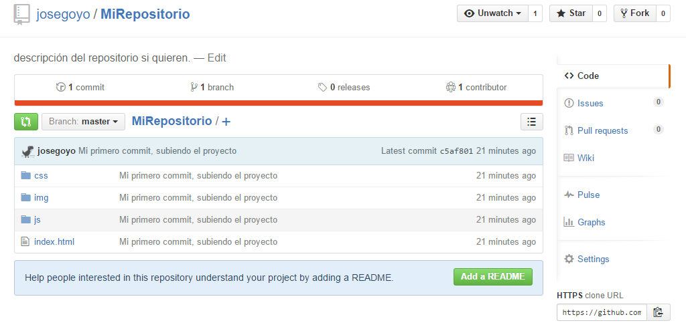

Para comenzar a trabajar en equipo es muy importante saber utilizar una herramienta que nos permita
tener el codigo de nuestro proyecto concentrado en un solo lugar y que todos podamos trabajar con ese 
mismo proyecto en conjunto, para ello es necesario conocer herramientas que nos faciliten ese aspecto,
una las de mas utilizadas por grandes empresas es Git ya que es un controlador de versiones que nos permite
trabajar en conjunto subiendo o bajando versiones del proyecto master.

En este ejemplo subiremos el proyecto a un repositorio de GitHub que nos permitira compartir nuestro proyecto
con todos.

Lo primero que tenemos que hacer es instalar [Git](https://git-scm.com/downloads), después tenemos que crear
una cuenta en [GitHub](https://github.com) una vez que tengamos nuestra cuenta iniciaremos sesion para crear 
nuestro nuevo repositorio como lo muestra la siguente imagen.

Una vez que selecciones la opción para crear un nuevo repositorio nos pedirá un nombre para está
y una descripción, tambien si queremos ponerlo publico o privado (para poner tu repositorio
privado tienes que pagar una couta), tal y como se muestra en la siguiente imagen, una vez que tengamos los datos definidos le damos al boton "Crear repositorio".

Ahora que ya creamos nuestro proyecto nos mostrará una pantalla como lo muestra la siguiente imagen, si nos
ponemos a leer un poco un ahí mismo nos dice como subir el proyecto a nuestro repositorio creado.

Ahora veremos la estructura de nuestro proyecto que esta de la sigueinte manera:


MiProyecto/
|
+-- js
|	+-- scritp.js
+-- css
|	+-- index.css
+-- img
|	+-- js-logo.png
+-- index.html


Ahora abriremos nuestra consola de Git y nos dirigiremos a la carpeta de nuestro proyecto (el que vamos a subir)
e iniciaremos nuestro git con el siguiente comando 


git init


La consola nos mostrara algo como lo siguiente.

Ahora agregaremos todos los archivo de nuestro proyecto con el siguiente comando, hay otras opciones con el comando
git add lo pueden leer checando la documentacíon oficial de [git add](https://git-scm.com/docs/git-add) pero
como nosotros subiremos todos los archivos usaremos el siguiente.


git add .


En la consola no mostrara nada al darle enter solo saltará de linea esperando otra entrada.

Pasaremos a realizar nuestro primer commit con el siguiente comando, de igual manera si quieren checar mas documentación
del comando [git commit](https://git-scm.com/docs/git-commit) pueden checar la pagina oficial.


git commit -m "Mi primero commit, subiendo el proyecto"


En la consola nos mostrara algo como lo siguiente, en donde nos mostrará los archivos de nuestro proyecto.

Ahora nos dirigiremos a la pantalla que nos mostro GitHub al crear el repositorio, donde copiaremos la direccion 
https para nuestro siguiente comando, en donde agregaremos un remote a nuestro repositorio, eso con el siguiente
comando.


git remote add origin https://github.com/josegoyo/MiRepositorio.git


> Recuerden que la direccion https va ser diferente al que se muestra en el ejemplo.

En la consola no nos mostrará nada solo saltará de linea esperando una nueva entrada como se muestra en la imagen.

Ahora solo queda hacer nuestro push para que el proyecto se vaya para el repositorio, esto con el siguiente comando.


git push -u origin master


nos mostrará algo como lo siguiente, en donde nos informa que ya se agrego el proyecto y se a creado un branch
llamado "master", como lo muestra la siguiente imagen.

> En caso de que les tire un error por configuracion de username e email, la configuración se hace con los siguientes comandos.


git config --global user.name "tuUsuario"
git config --global user.email tuCorreo@example.com


Una vez que subamos nuestro proyecto nos vamos a nuestro repositorio actualizamos la pantalla y veremos nuestro 
archivos como se muestra en la siguiente imagen.

Y listo ya tenemos nuestro proyecto en el repositorio.

