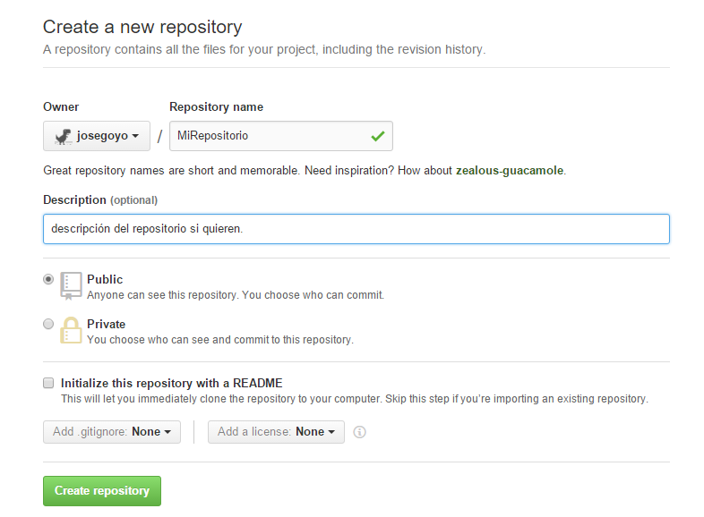
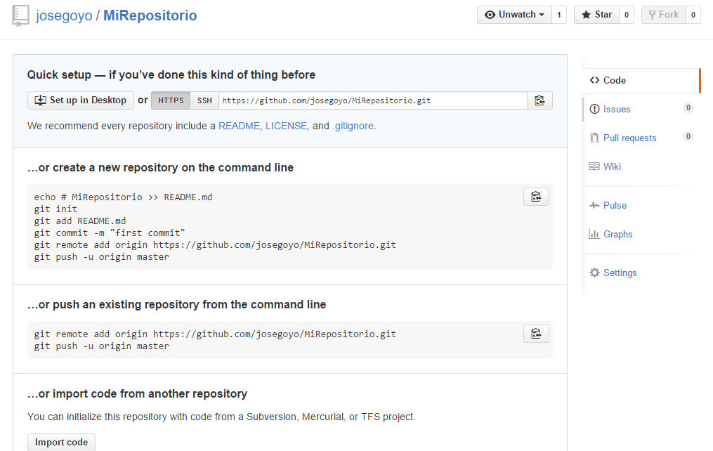

Para comenzar a trabajar en equipo es muy importante saber utilizar una herramienta que nos permita
tener el codigo de nuestro proyecto concentrado en un solo lugar y que todos podamos trabajar con ese 
mismo proyecto en conjunto, para ello es necesario conocer herramientas que nos faciliten ese aspecto,
una las de mas utilizadas por grandes empresas es Git ya que es un controlador de versiones que nos permite
trabajar en conjunto subiendo o bajando versiones del proyecto master.

En este ejemplo subiremos el proyecto a un repositorio de GitHub que nos permitira compartir nuestro proyecto
con todos.

Lo primero que tenemos que hacer es instalar [Git](https://git-scm.com/downloads), después tenemos que crear
una cuenta en [GitHub](https://github.com) una vez que tengamos nuestra cuenta iniciaremos sesion para crear 
nuestro nuevo repositorio como lo muestra la siguente imagen.

Una vez que selecciones la opción para crear un nuevo repositorio nos pedirá un nombre para está
y una descripción, tambien si queremos ponerlo publico o privado (para poner tu repositorio
privado tienes que pagar una couta), tal y como se muestra en la siguiente imagen, una vez que tengamos los datos definidos le damos al boton "Crear repositorio".

Ahora que ya creamos nuestro proyecto nos mostrará una pantalla como lo muestra la siguiente imagen, si nos
ponemos a leer un poco un ahí mismo nos dice como subir el proyecto a nuestro repositorio creado.

Ahora veremos la estructura de nuestro proyecto que esta de la sigueinte manera:


MiProyecto/
.
|
+-- js
|	+-- scritp.js
+-- css
|	+-- index.css
+-- img
|	+-- js-logo.png
+-- index.html


